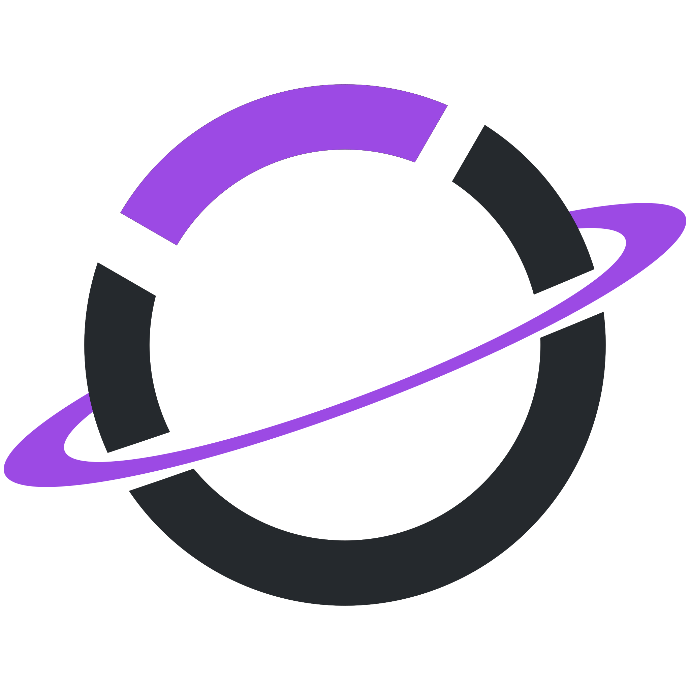
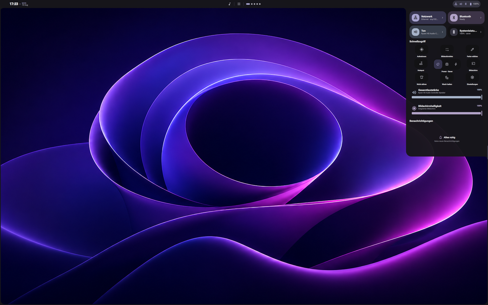
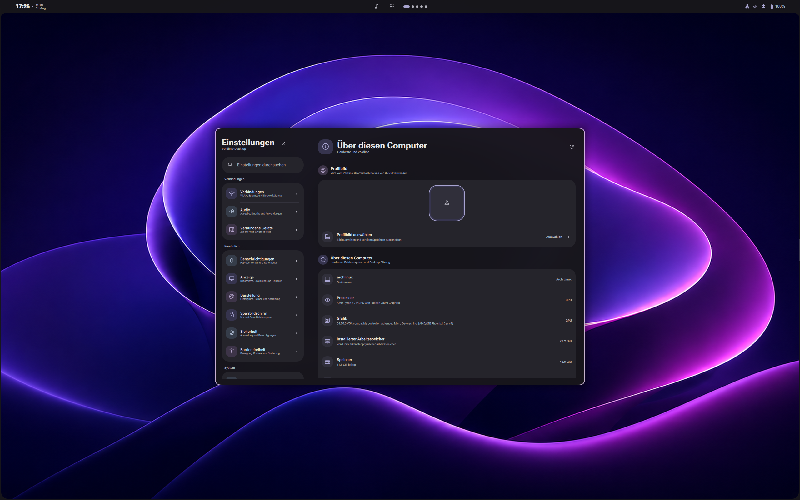
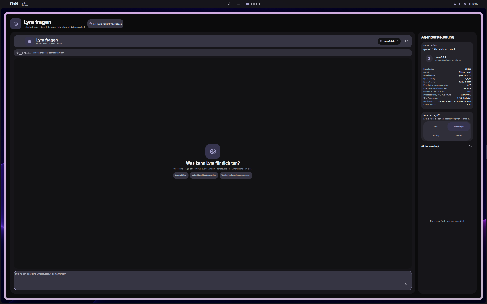

<p align="center">
  
</p>

# Voidline

Voidline is an experimental, integrated desktop environment built around
[Hyprland](https://hyprland.org/) and
[Quickshell](https://quickshell.org/). It combines a connected desktop bar,
Action Center, App Center, notifications, system tray, Settings, lock screen,
SDDM theme, a validated Rust backend and CLI, and a lightweight Rust terminal.
The visual language adapts modern Android and One UI ideas to a desktop while
retaining Voidline's connected concave-panel geometry and wallpaper-derived
palette.

**`0.3.0dev` is a development release.** It is intended for testing on Arch
Linux/Hyprland systems and is not yet production-stable. Back up your current
desktop configuration before installing.



<details>
<summary>More screenshots</summary>





</details>

## Included in 0.3.0dev

- Direction-aware bar and connected shell panels for top, bottom, left, and
  right layouts
- App Center with applications, games, overview, file search, calculator,
  clipboard/symbols, wallpapers, and commands
- Action Center with networking, Bluetooth, audio, resources, quick actions,
  brightness, notifications, and recording controls
- Normal tiled/floating Settings application with shared Android/One UI-style
  components
- NetworkManager Wi-Fi flows for new, saved, open, secured, and hidden networks
- PipeWire/WirePlumber audio, BlueZ device integration, displays, inputs, and
  hardware discovery
- Notification daemon and StatusNotifierItem system tray
- Wallpaper service, eight original wallpapers, dynamic palette generation,
  profile cache, lock screen, and matching SDDM theme
- Validated per-user Rust backend and globally installed `voidlinectl`
- Rust/GTK/VTE terminal application
- `en-US`, `de-DE`, and `pl-PL` locale catalogues
- Optional **Lyra — Extreme Beta** local assistant integration

The detailed implementation boundary and known incomplete integrations are
kept in the [architecture audit](.config/quickshell/void/ARCHITECTURE_AUDIT.md).

## Requirements

- Arch Linux
- A working Hyprland session
- Quickshell
- NetworkManager
- PipeWire and WirePlumber
- Rust and native build tools (the development installer builds the Rust
  components locally)

The installer checks the concrete runtime dependencies. Roboto Flex, Material
Symbols, Papirus, recording, DDC/CI, CUPS, SANE, and Lyra dependencies are
reported separately when absent. Lyra is not part of the default install and
does not download a model automatically.

## Install

Clone the release and run the installer as your normal desktop user:

```bash
git clone --branch v0.3.0dev --depth 1 https://github.com/ShadowOkami4/voidline.git
cd voidline
./install.sh --install-deps
```

The default system install builds as the current user and uses `sudo` only for
the packaged files under `/usr`. It never runs Quickshell, the backend, the
terminal, or Lyra as root.

Optional components:

```bash
# Matching SDDM theme
./install.sh --install-deps --with-sddm

# Lyra — Extreme Beta; installs no model by itself
./install.sh --install-deps --with-lyra

# Both
./install.sh --install-deps --with-sddm --with-lyra
```

For an unprivileged test install, use `./install.sh --user`. A user install
cannot provide the system Polkit helper or SDDM theme, and `~/.local/bin` must
already be in `PATH`; the installer deliberately does not edit shell startup
files.

The installer:

- backs up an edited Hyprland file under
  `${XDG_STATE_HOME:-~/.local/state}/voidline/backups`;
- adds one marked integration line only when Voidline bindings are not already
  present;
- preserves an existing portal configuration instead of overwriting it;
- stores packaged code in `/usr/share`, not in a working source directory;
- leaves personal wallpapers and persistent settings untouched.

## Update

Check out the desired release and run the installer again. Repository-owned
files are replaced atomically where possible; persistent XDG state remains:

```bash
git fetch --tags
git checkout v0.3.0dev
./install.sh --install-deps
```

Pass `--with-lyra` again if the optional assistant package should remain
installed. Omitting it removes only the packaged Lyra launcher/service
integration, not conversations or separately downloaded model data.

## Uninstall

From a matching source/release directory:

```bash
./uninstall.sh
```

Add `--remove-sddm` to remove the login theme. `--purge-generated` removes
Voidline caches and transient state. The standard uninstall preserves personal
configuration, wallpapers, AI models, conversations, and backups.

## Basic usage

The default integration includes:

| Shortcut | Action |
| --- | --- |
| `Super+Space` | App Center |
| `Super+A` | Action Center |
| `Super+I` | Settings |
| `Super+Tab` | Window/workspace overview |
| `Super+Q` | Find Files |
| `Super+V` | Clipboard history |
| `Super+.` | Clipboard and symbols |
| `Ctrl+Alt+Delete` | Power menu |
| `Print` | Screenshot |
| `Super+Shift+S` | Region screenshot |
| `Super+L` | Lock screen |

`voidlinectl` uses the same validated backend as the graphical interfaces and
works from every directory after a system install:

```bash
voidlinectl status
voidlinectl --json status network
voidlinectl wallpaper set "$HOME/Pictures/Wallpapers/example.png"
voidlinectl panel open action-center
voidlinectl settings open display
voidlinectl appearance bar left
voidlinectl --dry-run session reboot
```

Run `voidlinectl --help` for all commands and installable Bash, Zsh, and Fish
completions.

## Optional Lyra assistant

Lyra remains an **Extreme Beta**. When omitted, its feature manifest, launcher,
user service, provider probes, and model loading are absent. No AI service is
started and no model is downloaded. When selected, inference stays in a
separate unprivileged user service and model-proposed actions still pass through
the fixed, validated backend action schema. See
[AI architecture](.config/quickshell/void/AI_ARCHITECTURE.md).

## Known limitations

- Hardware support for DDC/CI, HDR, unusual EDID data, Bluetooth pairing modes,
  printers, and scanners varies and needs wider real-device testing.
- Package updates are a development interface, not yet a full libalpm software
  center.
- VPN, proxy, advanced DNS management, richer accessibility services, and some
  device-specific actions remain incomplete or capability-gated.
- Lyra tool routing, web-source quality, resource scheduling, and local-model
  compatibility are experimental.
- The SDDM theme uses cached session data and only refreshes user wallpaper and
  avatar state after an active Voidline session exports it.

No visible control should silently pretend to work: unsupported functionality
is intended to remain hidden or explicitly disabled. Please report violations.

## Development and issue reports

Backend checks:

```bash
cd backend
cargo fmt --all --check
cargo clippy --workspace --all-targets -- -D warnings
cargo test --workspace
```

Shell checks are in `.config/quickshell/void/scripts/`, including translation
coverage and runtime audits. Bug reports should include the affected monitor/bar
orientation, reproduction steps, `voidlinectl health`, and the relevant
`journalctl --user` excerpt with secrets removed.

Open an issue at [ShadowOkami4/voidline](https://github.com/ShadowOkami4/voidline/issues).
For security issues, follow [SECURITY.md](SECURITY.md) and do not post secrets or
proof-of-concept credentials publicly.

## License

Voidline source and original project assets are available under the
[MIT License](LICENSE). Third-party marks and Material Symbols retain their
upstream licenses and trademark policies; attribution is recorded beside those
assets.
